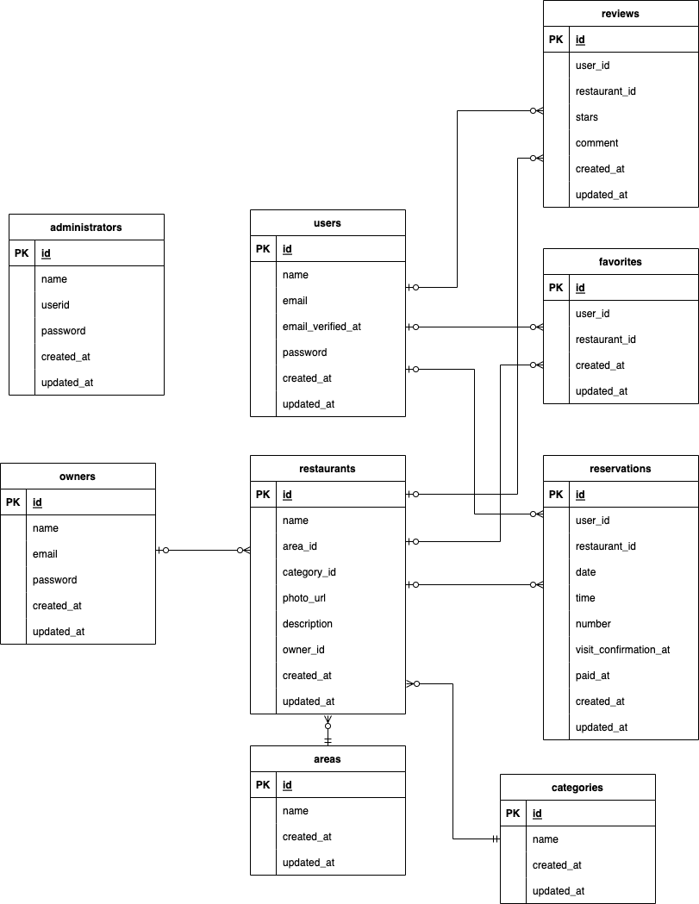

# Rese

## 概要
飲食店予約サービス

## 作成した目的
- 自社の飲食店予約サービスを開発し、サービス手数料がかからないようにする
- 従来より魅力的なサービスを作成し、ユーザー数を増やす

## アプリケーションURL
http://localhost

## 他のリポジトリ
なし

## 機能一覧
| 機能名 | 説明 |
|-----------|-----------|
| ユーザー登録 | ユーザー情報を登録する。 |
| ユーザーログイン | Eメールとパスワードで認証し、ユーザー権限でログインする。 |
| ユーザーログアウト | ユーザー権限のログイン状態を解除する。 |
| ユーザーEメール認証 | ユーザーの登録したEメールアドレスに認証用URLを送付し、Eメール認証を行う。 |
| ユーザー情報取得 |  |
| ユーザー飲食店お気に入り一覧取得 | ユーザーがお気に入り登録した飲食店の一覧を取得する。 |
| ユーザー飲食店予約情報取得 | ユーザーの予約情報を取得する。 |
| ユーザーEメール認証 | ユーザーに認証用URLのついたメールを送信し、Eメール認証を行う。 |
| 飲食店一覧取得 | 登録済みの飲食店の一覧情報を取得する。 |
| 飲食店詳細取得 | 各飲食店の詳細情報を取得する。 |
| 飲食店お気に入り追加 | 飲食店のお気に入り情報を追加する。 |
| 飲食店お気に入り削除 | 飲食店のお気に入り情報を削除する。 |
| 飲食店予約情報追加 | 飲食店の予約情報を追加する。同時に来店確認のためのQRコードを発行し、それを添付した予約確認メールをユーザーに送信する。 |
| 飲食店予約情報削除 | 飲食店の予約情報を削除する。 |
| 飲食店予約情報更新 | 飲食店の予約情報を更新する。 |
| エリアで検索する | 飲食店一覧画面でエリアによる絞り込みを行う。 |
| ジャンルで検索する | 飲食店一覧画面でジャンルによる絞り込みを行う。 |
| キーワードで検索する | 飲食店一覧画面でキーワードによる絞り込みを行う。 |
| 飲食店レビュー一覧取得 | 各飲食店のレビュー一覧情報を取得する。 |
| 飲食店レビュー追加 | 来店した飲食店に対し、レビューを追加する。 |
| クーポン購入 | 予約後に、来店時に使えるクーポンをStripe決済で購入する。 |
| 管理者ログイン | ユーザーIDとパスワードで認証し、管理者権限でログインする。 |
| 管理者ログアウト | 管理者権限のログイン状態を解除する。 |
| 店舗代表者登録 | 店舗代表者情報を登録する。 |
| 店舗代表者一覧取得 | 登録済みの店舗代表者の一覧情報を取得する。 |
| 店舗代表者ログイン | Eメールとパスワードで認証し、店舗代表者権限でログインする。 |
| 店舗代表者ログアウト | 店舗代表者権限のログイン状態を解除する。 |
| 飲食店情報登録 | 店舗代表者が飲食店情報を登録する。 |
| 飲食店情報更新 | 店舗代表者が飲食店情報を更新する。 |
| 飲食店予約情報一覧取得 | 予約の一覧情報を取得する。 |
| お知らせメール送信 | 店舗代表者が予約ユーザーに対しお知らせメールを送信する。 |
| 予約情報リマインダーメール送信 | 予約当日の朝にユーザーにリマインダーメールを自動送信する。 |
| 来店照合 | ユーザーの来店時に、予約時にユーザーに発行したQRコードを店側で照合する。 |


## 使用技術(実行環境)
- PHP 8.2.15
- Laravel 8.83.27
- MySQL 8.0.26
- nginx 1.21.1

## テーブル設計

### usersテーブル
| カラム名 | 型 | PRIMARY KEY | UNIQUE KEY | NOT NULL | FOREIGN KEY |
|------|------|------|------|------|------|
| id | unsigned bigint | ◯ | ◯ | ◯ |  |
| name | varchar(255) |  |  | ◯ |  |
| email | varchar(255) |  |  | ◯ |  |
| email_verified_at | timestamp |  |  |  |  |
| password | varchar(255) |  |  | ◯ |  |
| created_at | timestamp |  |  |  |  |
| updated_at | timestamp |  |  |  |  |

### restaurantsテーブル
| カラム名 | 型 | PRIMARY KEY | UNIQUE KEY | NOT NULL | FOREIGN KEY |
|------|------|------|------|------|------|
| id | unsigned bigint | ◯ | ◯ | ◯ |  |
| name | varchar(255) |  |  | ◯ |  |
| area_id | unsigned unsigned bigint|  |  | ◯ | areas(id) |
| category_id | unsigned bigint	|  |  | ◯ | category(id) |
| photo | varchar(255) |  |  | ◯ |  |
| description | text |  |  | ◯ |  |
| owner_id | unsigned unsigned bigint|  |  |  | owner(id) |
| created_at | timestamp |  |  |  |  |
| updated_at | timestamp |  |  |  |  |

### areasテーブル
| カラム名 | 型 | PRIMARY KEY | UNIQUE KEY | NOT NULL | FOREIGN KEY |
|------|------|------|------|------|------|
| id | unsigned bigint | ◯ | ◯ | ◯ |  |
| name | varchar(255) |  |  | ◯ |  |
| created_at | timestamp |  |  |  |  |
| updated_at | timestamp |  |  |  |  |

### categoriesテーブル
| カラム名 | 型 | PRIMARY KEY | UNIQUE KEY | NOT NULL | FOREIGN KEY |
|------|------|------|------|------|------|
| id | unsigned bigint | ◯ | ◯ | ◯ |  |
| name | varchar(255) |  |  | ◯ |  |
| created_at | timestamp |  |  |  |  |
| updated_at | timestamp |  |  |  |  |

### reservationsテーブル
| カラム名 | 型 | PRIMARY KEY | UNIQUE KEY | NOT NULL | FOREIGN KEY |
|------|------|------|------|------|------|
| id | unsigned bigint | ◯ | ◯ | ◯ |  |
| user_id | unsigned bigint |  |  | ◯ | users(id) |
| restaurant_id | unsigned bigint |  |  | ◯ | restaurants(id) |
| date | date |  |  | ◯ |  |
| time | time |  |  | ◯ |  |
| number | int |  |  | ◯ |  |
| visit_confirmation_at | datetime |  |  |  |  |
| paid_at | datetime |  |  |  |  |
| created_at | timestamp |  |  |  |  |
| updated_at | timestamp |  |  |  |  |

### favoritesテーブル
| カラム名 | 型 | PRIMARY KEY | UNIQUE KEY | NOT NULL | FOREIGN KEY |
|------|------|------|------|------|------|
| id | unsigned bigint | ◯ | ◯ | ◯ |  |
| user_id | unsigned bigint |  |  | ◯ | users(id) |
| restaurant_id | unsigned bigint |  |  | ◯ | restaurants(id) |
| created_at | timestamp |  |  |  |  |
| updated_at | timestamp |  |  |  |  |

### reviewsテーブル
| カラム名 | 型 | PRIMARY KEY | UNIQUE KEY | NOT NULL | FOREIGN KEY |
|------|------|------|------|------|------|
| id | unsigned bigint | ◯ | ◯ | ◯ |  |
| user_id | unsigned bigint |  |  | ◯ | users(id) |
| restaurant_id | unsigned bigint |  |  | ◯ | restaurants(id) |
| stars | int |  |  | ◯ |  |
| comment | text |  |  | ◯ |  |
| created_at | timestamp |  |  |  |  |
| updated_at | timestamp |  |  |  |  |

### administratorsテーブル
| カラム名 | 型 | PRIMARY KEY | UNIQUE KEY | NOT NULL | FOREIGN KEY |
|------|------|------|------|------|------|
| id | unsigned bigint | ◯ | ◯ | ◯ |  |
| name | varchar(255) |  |  | ◯ |  |
| userid | varchar(255) |  |  | ◯ |  |
| password | varchar(255) |  |  | ◯ |  |
| created_at | timestamp |  |  |  |  |
| updated_at | timestamp |  |  |  |  |

### ownersテーブル
| カラム名 | 型 | PRIMARY KEY | UNIQUE KEY | NOT NULL | FOREIGN KEY |
|------|------|------|------|------|------|
| id | unsigned bigint | ◯ | ◯ | ◯ |  |
| name | varchar(255) |  |  | ◯ |  |
| email | varchar(255) |  |  | ◯ |  |
| password | varchar(255) |  |  | ◯ |  |
| created_at | timestamp |  |  |  |  |
| updated_at | timestamp |  |  |  |  |

## ER図


## 環境構築
### Dockerビルド
1. `git clone git@github.com:chie-ichi/trial02.git`
2. `docker-compose up -d --build`

＊ MySQLは、OSによって起動しない場合があるのでそれぞれのPCに合わせてdocker-compose.ymlファイルを編集してください。

### Laravel環境構築
1. `docker-compose exec php bash`
2. `composer install`
3. .env.exampleファイルから.envを作成し、環境変数を変更
4. `php artisan key:generate`
5. `php artisan migrate`
6. `php artisan db:seed`

＊ Stripeによる支払い機能を動作させるため、手順3で.envファイルにStripeの公開可能キー・シークレットキーを以下の形式で記述してください。
```
STRIPE_KEY=公開可能キー
STRIPE_SECRET=シークレットキー
```

＊ Mailtrapを使用してメール送信の動作確認を行うため、手順3で.envファイルにメールの設定を以下のように記述してください。
```
MAIL_MAILER=smtp
MAIL_HOST=sandbox.smtp.mailtrap.io
MAIL_PORT=2525
MAIL_USERNAME=ユーザー名
MAIL_PASSWORD=パスワード
MAIL_ENCRYPTION=tls
MAIL_FROM_ADDRESS=example@example.com
MAIL_FROM_NAME="${APP_NAME}"
```

### テストアカウント
テストアカウント情報は以下の通り。
※以下のユーザーは上記のLaravel環境構築作業の手順6を行うと生成される。

### ユーザーアカウント
| 名前 | Eメール | パスワード |
|-----------|-----------|-----------|
| 田中一郎 | test1@test.jp | password1 |
| 田中二郎 | test2@test.jp | password2 |
| 田中三郎 | test3@test.jp | password3 |
| 田中四郎 | test4@test.jp | password4 |
| 田中五郎 | test5@test.jp | password5 |
| 田中六郎 | test6@test.jp | password6 |
| 田中七郎 | test7@test.jp | password7 |
| 田中八郎 | test8@test.jp | password8 |
| 田中九郎 | test9@test.jp | password9 |
| 田中十郎 | test10@test.jp | password10 |

### 管理者アカウント
| 名前 | ユーザーID | パスワード |
|-----------|-----------|-----------|
| 管理者1 | admin1 | password1 |
| 管理者2 | admin2 | password2 |
| 管理者3 | admin3 | password3 |

### 店舗代表者アカウント
| 名前 | Eメール | パスワード |
|-----------|-----------|-----------|
| 店舗代表者1 | owner1@test.jp | password1 |
| 店舗代表者2 | owner2@test.jp | password2 |
| 店舗代表者3 | owner3@test.jp | password3 |
| 店舗代表者4 | owner4@test.jp | password4 |
| 店舗代表者5 | owner5@test.jp | password5 |
| 店舗代表者6 | owner6@test.jp | password6 |
| 店舗代表者7 | owner7@test.jp | password7 |
| 店舗代表者8 | owner8@test.jp | password8 |
| 店舗代表者9 | owner9@test.jp | password0 |
| 店舗代表者10 | owner10@test.jp | password10 |
| 店舗代表者11 | owner11@test.jp | password11 |
| 店舗代表者12 | owner12@test.jp | password12 |
| 店舗代表者13 | owner13@test.jp | password13 |
| 店舗代表者14 | owner14@test.jp | password14 |
| 店舗代表者15 | owner15@test.jp | password15 |
| 店舗代表者16 | owner16@test.jp | password16 |
| 店舗代表者17 | owner17@test.jp | password17 |
| 店舗代表者18 | owner18@test.jp | password18 |
| 店舗代表者19 | owner19@test.jp | password19 |
| 店舗代表者20 | owner20@test.jp | password20 |


## 申し送り事項

### メール送信を伴う機能について
Mailtrap (https://mailtrap.io/) を使用したテスト送信でのみ動作確認済みです。

### 決済機能について
Stripeのテスト環境およびテストカードを用いて動作確認済みです。  
Stripeのテストカードの情報については以下をご参照ください。  
https://docs.stripe.com/testing?locale=ja-JP
